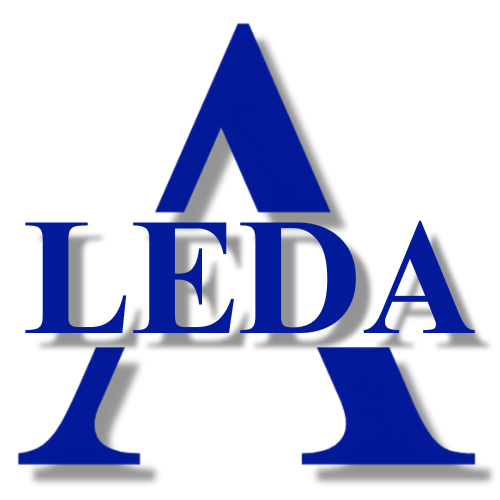
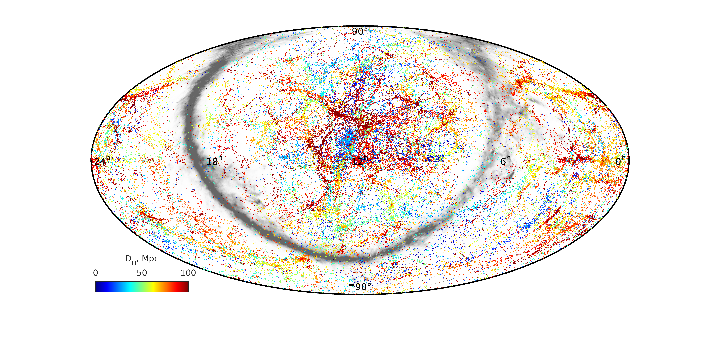
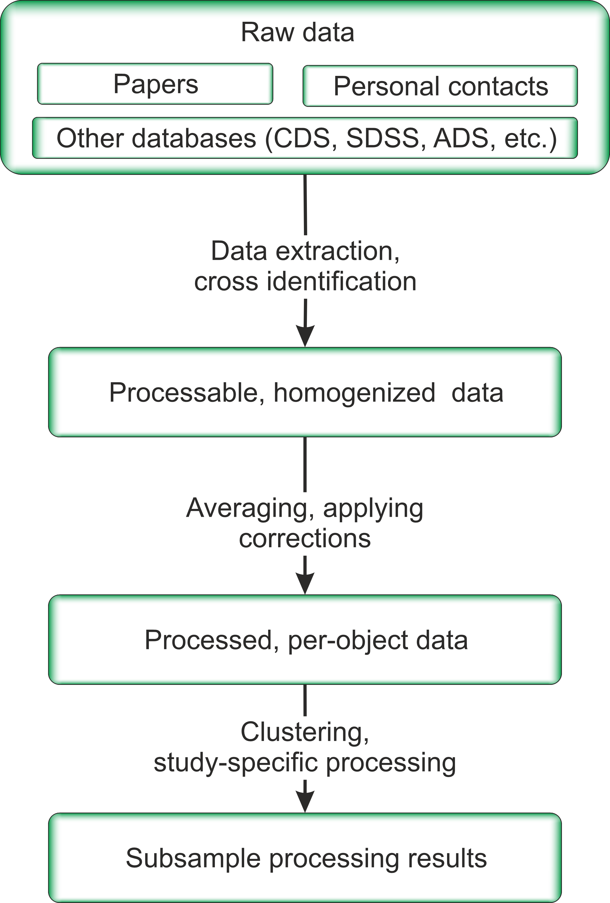

# [HyperLeda database](https://leda.univ-lyon1.fr/)

[HyperLEDA](https://leda.univ-lyon1.fr/) is a database and a collection of tools to study the physics of galaxies and cosmology. 
The project is maintained by a collaboration between [Observatoire de Lyon (France)](https://observatoire.univ-lyon1.fr/) and [the Special Astrophysical Observatory (Russia)](https://www.sao.ru/).

The HyperLeda database integrates measurements published in the literature and data from modern surveys into a set of compilation catalogs. 
Each catalog collects specific data on astronomical objects into a unified structure with a clear description of each series of measurements, including documentation of accuracy, systematic errors, and flagging of doubtful and erroneous data. 
The main part, the LEDA catalog, brings together information from the compilations to provide a consistent description of all objects. 
For this purpose the raw measurements are combined into the same scale taking into account systematic shifts and data scatter. 
The physical values are determined from the homogenized data taking into account different types of corrections (Galactic extinction, object inclination, line-width broadening due to redshift, etc.).

# History

Leda is the oldest astronomical database dedicated to the study of extragalactic objects, galaxy physics and cosmology. 
It has a long history and is widely used in the astronomical community. 
The project began in 1983 by George Paturel in the framework of the development of the Third Reference Catalog of Bright Galaxies (de Vaucouleurs et al. 1991, RC3). 
HyperLeda took its present form after merger with the catalog of kinematics of early-type galaxies, Hypercat (Prugniel & Simien 1996), in 2000. 
In the spirit of the famous series of Bright Galaxy Reference Catalogues (RC1, RC2, RC3) by de Vaucouleurs and co-workers, Leda provides a unified homogeneous description of several million galaxies, which is one of the main features that distinguishes it from other extragalactic databases.

# New generation

Since the project has an extremely long history of development, it accumulated a critical mass of irrelevant and legacy code that is hard to maintain and scale.
The modern avalanche of observational data challenges us to speed up data collection and analysis. 
The main goal of our project is to develop an application that provides the ability to easily manage the data and add new information, as well as calculate the physical characteristics of galaxies. 
As before the Leda database will provide the astronomical community with uniform information about extragalactic objects, combining both observable quantities such as apparent magnitude, size, redshift, and physical characteristics such as the total mass of the galaxy, stars and gas. 
This will be the basis for the study of individual galaxies, the identification of galaxy groups and clusters, large-scale structures, and the study of flows in the Universe.

## HyperLeda team

- Dmitry Makarov (SAO RAS, Russia)
- Danila Makarov (SAO RAS, Russia)
- Artyom Zaporozhets (SAI MSU, SAO RAS, Russia)
- Valeria Selchonok (SAI MSU, SAO RAS, Russia)
- Elizaveta Kostromina  (HSE University, Russia)
- Eugene Sendzikas  (SAO RAS, Russia)

## Financial support

The project is partially supported by the Russian Science Foundation grant № 24-12-00277

## Data flow

First there comes raw data, taken from an article, imported from some other database or sky survey, or even got by direct request by moderators.
Then physical values are extracted from raw data, objects are identified with those that are already present in the database, and the data is homogenized and stored in the DB.  
To produce the next level of data, averaging, corrections and offsets are performed.
Thus, we have a set of measurements for each single physical object such as galaxies.
At the last stage, complex processing and query can be performed. 
This is done to further explore a specific scientific question. 
All levels of data are available to the user and can be used for his research.

## New codebase

The codebase has been completely reworked using modern astronomical computing packages such as Astropy and Clean Architecture principles. 
Using modern and maintained astronomical packages will result in more accurate and relevant calculations. 
The redesigned codebase will result in a less human-dependent and more transparent data addition process, resulting in a dramatic data amount expansion and an improved user experience.

## Release and further plans

We plan to redesign the Leda database for a more accurate description and further processing of the observed parameters; 
replenish it with data from modern redshift and imaging surveys; perform uniform photometry for a large sample of galaxies 
based on public photometric surveys of the sky. 
All features of the refactored project will be available through HTTP API, that is for now really close to release. 
The browser client will be released afterwards. 
The Leda database will serve as a basis for clustering and creating a catalog of galaxy groups and clusters, as well as for building specialized catalogs of the Local Volume galaxies, studying stellar populations in the nearby Universe, studying edge-on galaxies, etc.

## Release plan

- The project is presented at [the All Russian Astronomical Conference](https://vak2024.ru/ru/index.php)
- The project is presented at a [Focus Meeting 9 "Measures of Luminous and Dark Matter in Galaxies Across Time"](https://ga24dmfm9.saao.ac.za/) within [the XXXII IAU GA 2024](https://astronomy2024.org/) 
- Developer interface is launched
- The structure of the main directories has been reworked (astrometry, redshifts, photometry)
- GitHub repository is created